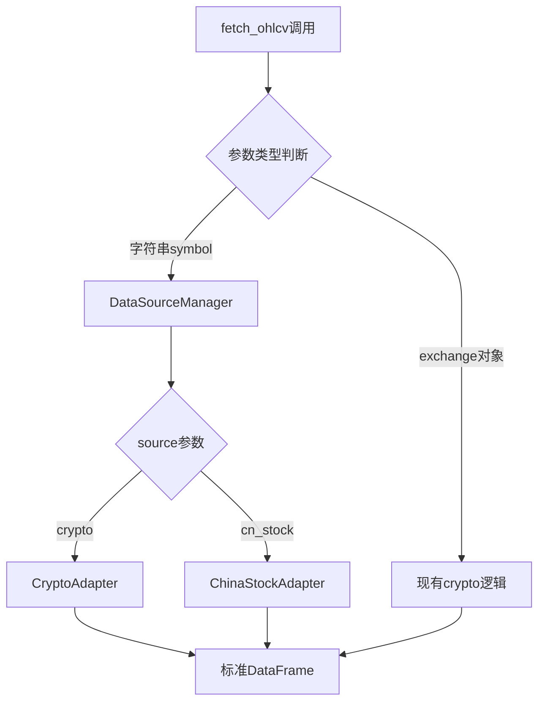

# A股数据支持设计文档

## Overview

扩展`fetch_ohlcv`函数支持多数据源，通过函数重载实现向后兼容。新增A股数据获取能力，保持现有crypto功能不变。

## Architecture

### 核心设计原则
- **向后兼容**：现有调用方式保持不变
- **渐进迁移**：提供简化的新接口
- **数据源隔离**：不同数据源独立配置，互不影响

### 函数重载设计

```python
# 现有接口保持不变（4参数）
def fetch_ohlcv(exchange, symbol, timeframe, limit)

# 新增便捷接口（2-4参数）  
def fetch_ohlcv(symbol, source='crypto', timeframe='1d', limit=700)
```

通过参数类型和数量判断调用方式：
- 第一个参数是exchange对象 → 使用现有逻辑
- 第一个参数是字符串 → 使用新的多数据源逻辑

## Components and Interfaces

### 1. 数据源管理器
```python
class DataSourceManager:
    def get_data(self, symbol: str, source: str, timeframe: str, limit: int) -> pd.DataFrame
```

### 2. A股数据适配器  
```python
class ChinaStockAdapter:
    def fetch_data(self, symbol: str, limit: int) -> pd.DataFrame
    def normalize_data(self, raw_data) -> pd.DataFrame
```

### 3. Crypto数据适配器
```python  
class CryptoAdapter:
    def fetch_data(self, symbol: str, timeframe: str, limit: int) -> pd.DataFrame
```

### 接口映射



## Data Models

### 统一数据格式
所有数据源返回相同格式：
```python
columns = ['timestamps', 'open', 'high', 'low', 'close', 'volume', 'amount']
dtypes = {
    'timestamps': 'datetime64[ms]',
    'open': 'float64', 
    'high': 'float64',
    'low': 'float64', 
    'close': 'float64',
    'volume': 'float64',
    'amount': 'float64'  # A股：volume*close，crypto：volume*avg_price
}
```

### A股数据转换
Tushare原始格式 → 标准格式：
```python
# Tushare字段映射
field_mapping = {
    'trade_date': 'timestamps',
    'open': 'open',
    'high': 'high', 
    'low': 'low',
    'close': 'close',
    'vol': 'volume'
}

# amount计算：volume * close
df['amount'] = df['volume'] * df['close']
```

## Error Handling

### 异常层次
```python
class DataSourceError(Exception): pass
class ConfigurationError(DataSourceError): pass  # tushare token缺失
class NetworkError(DataSourceError): pass        # 网络请求失败  
class DataFormatError(DataSourceError): pass     # 数据格式异常
```

### 错误处理策略
1. **配置错误**：抛出异常，不允许静默失败
2. **网络错误**：返回空DataFrame，记录错误日志
3. **数据格式错误**：抛出异常，阻止错误数据传播
4. **数据源隔离**：tushare故障不影响ccxt功能

## Testing Strategy

### 单元测试
- `test_fetch_ohlcv_backward_compatibility()` - 确保现有调用不受影响
- `test_china_stock_data_format()` - A股数据格式标准化
- `test_error_handling()` - 异常处理覆盖
- `test_source_isolation()` - 数据源故障隔离

### 集成测试  
- 真实A股数据获取测试（需tushare token）
- crypto数据功能回归测试
- 预测功能端到端测试

### 关键测试用例
```python
# 向后兼容性
assert fetch_ohlcv(exchange, 'BTC/USDT', '15m', 300).equals(原有结果)

# 新接口
df = fetch_ohlcv('600848', source='cn_stock')
assert len(df) >= 365  # 足够预测数据
assert list(df.columns) == expected_columns

# 错误处理
with pytest.raises(ValueError):
    fetch_ohlcv('invalid', source='invalid_source')
```

## Implementation Plan

### Phase 1: 核心架构
1. 实现参数重载逻辑
2. 创建DataSourceManager基础框架
3. 确保现有功能零影响

### Phase 2: A股支持
1. 集成tushare SDK
2. 实现ChinaStockAdapter
3. 数据格式标准化

### Phase 3: 测试与优化  
1. 全面测试覆盖
2. 性能优化
3. 文档更新

## Technical Constraints

- 支持tushare提供的所有timeframe（1m, 5m, 15m, 30m, 1h, 1d等）
- 数据量限制遵循tushare API真实限制，不做人为约束
- 需要有效tushare token配置
- 不修改现有crypto相关代码路径

## Risk Mitigation

1. **向后兼容风险**：通过严格的参数类型检查和充分的回归测试
2. **数据源耦合风险**：采用适配器模式，保持数据源独立
3. **配置管理风险**：明确的错误提示和文档说明
4. **性能风险**：缓存和批量获取优化（后续版本）